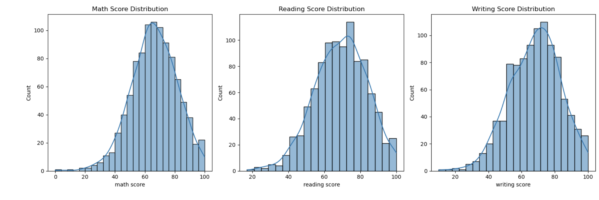
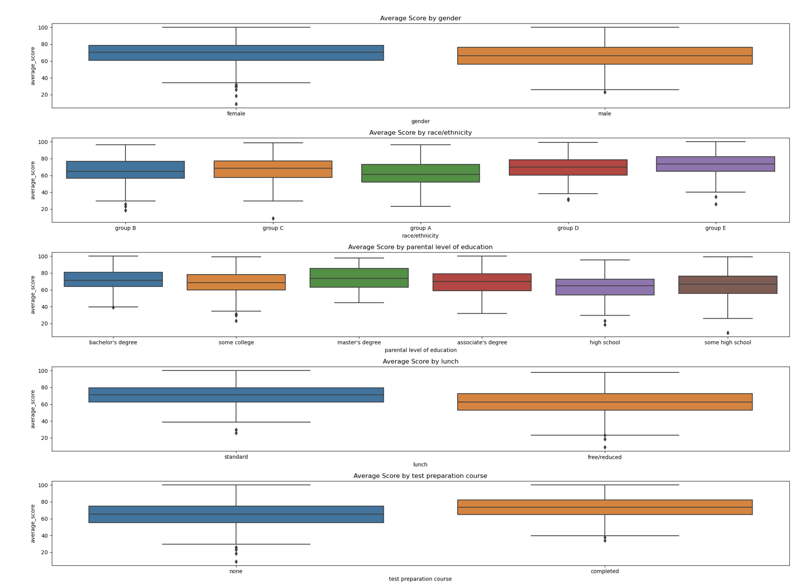
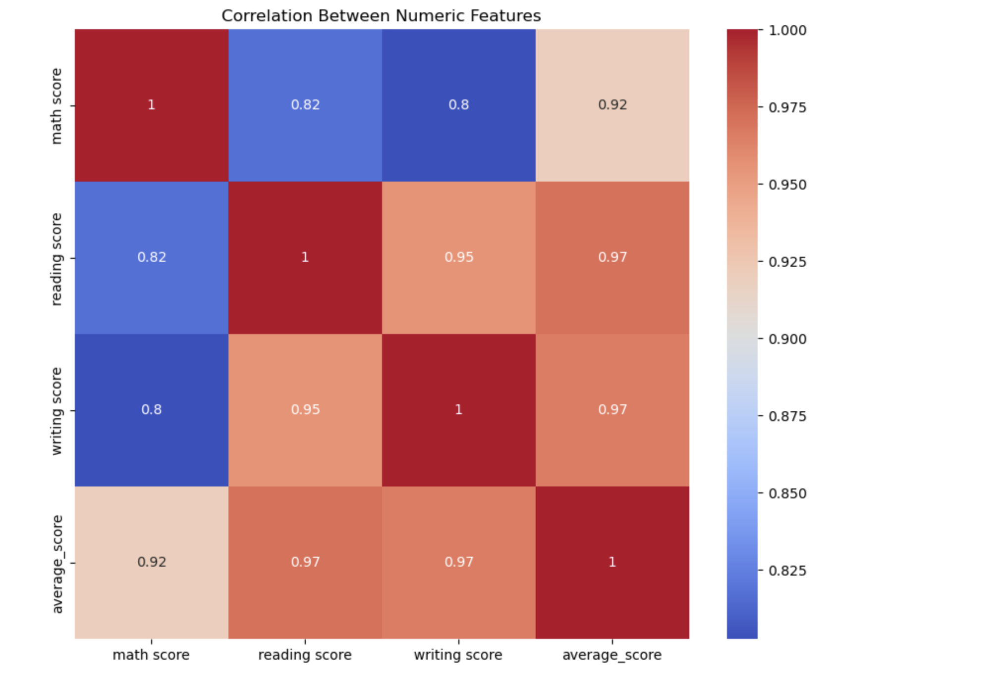
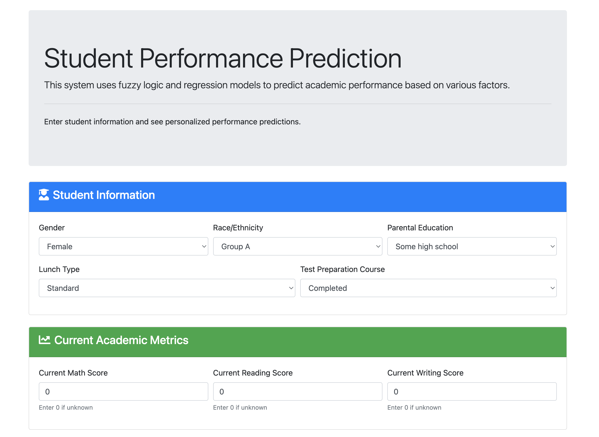
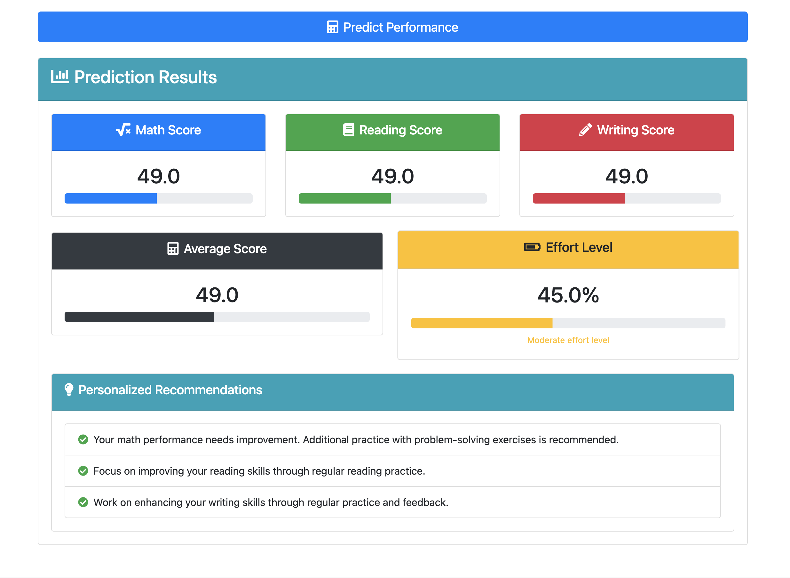

# Student Performance Prediction System

## Project Description

The Student Performance Prediction System is an expert system that uses fuzzy logic and regression techniques to predict student academic outcomes based on demographic factors and study habits. The system takes various student metrics as input, processes them through a combination of fuzzy logic membership functions and regression models, and provides predictions along with personalized advice for academic improvement.

## Group 3
## Team Members

- Izuafa Abdulrafiu Braimah (VUG/SEN/22/7708) - Data Modeling & Testing
- Anigbogu Olivia (VUG/SEN/22/7174) - User Interface Design (HTML/CSS)
- Simun Nungwa (VUG/SEN/22/7426) - Flask Application Development

## Dataset Source

This project uses the Student Performance Dataset from Kaggle, which contains information about student demographics, academic history, and test scores. The dataset includes features such as gender, race/ethnicity, parental level of education, lunch type, test preparation completion status, and scores in math, reading, and writing.

## System Components

### 1. Data Processing & Modeling

- **Dataset Features**: gender, race/ethnicity, parental level of education, lunch, test preparation course, math score, reading score, writing score
- **Model Implementation**: Combined fuzzy logic for subjective metrics with regression models for prediction
- **Output**: A trained model saved as a pickle file that is loaded by the Flask backend

### 2. Flask Backend

- Handles routing and request processing
- Loads the pickled model for predictions
- Processes form inputs and returns prediction results

### 3. Frontend Interface

- Collects user inputs through forms
- Displays prediction results and recommendations
- Provides interactive elements for subjective metrics like attendance, study time, and motivation

## Installation & Setup Instructions

1. Clone the repository:
   ```
   git clone https://github.com/Ramseyxlil/Student-Performance-Prediction-System.git
   cd Student-Performance-Prediction-System
   ```

2. Create and activate a virtual environment:
   ```
   python -m venv venv
   source venv/bin/activate  # On Windows: venv\Scripts\activate
   ```

3. Install the required dependencies:
   ```
   pip install -r requirements.txt
   ```

4. Run the Flask application:
   ```
   python app.py
   ```

5. Open a web browser and navigate to:
   ```
   http://127.0.0.1:5000/
   ```

## Technical Implementation

### Fuzzy Logic Component

The system uses scikit-fuzzy to implement a fuzzy inference system that calculates an "effort level" based on:
- **Attendance Rate**: Percentage of classes attended (0-100%)
- **Study Time**: Hours spent studying per week (0-40 hours)

The fuzzy logic component defines membership functions for low, medium, and high levels of each input, and creates rules that map combinations of these inputs to effort levels.

### Regression Model

Linear regression models are used to predict scores in three subject areas:
- Math
- Reading
- Writing

These models are trained on demographic and academic features from the dataset.

### Integration Approach

The predictions from the regression models are adjusted based on the fuzzy effort level. Higher effort levels can increase predicted scores, while lower effort levels can decrease them. This allows the system to take into account both objective demographic factors and subjective effort metrics.

## Test Cases and Results

We conducted extensive testing of our system, with both the fuzzy logic component in isolation and the combined model.

### Fuzzy Logic Component Testing

- Low attendance (20%), minimal study (5h/week) → Effort level=15.56/100
- Medium attendance (50%), low study (10h/week) → Effort level=50.00/100
- Medium attendance (60%), medium study (20h/week) → Effort level=50.00/100
- High attendance (85%), medium study (15h/week) → Effort level=70.17/100
- High attendance (95%), high study (30h/week) → Effort level=84.44/100

### Combined Model Testing

We tested various student profiles with different attendance and study time inputs. For example:

**Test Case 5:**
Student with attendance=60%, study_time=15h/week:
- Calculated effort level: 50.00/100
- Actual vs Predicted Scores:
  - Math: 45.0 vs 53.6
  - Reading: 47.0 vs 53.4
  - Writing: 49.0 vs 47.9
  - Average: 47.0 vs 51.6
- Recommendations:
  - Your math performance needs improvement. Additional practice with problem-solving exercises is recommended.
  - Focus on improving your reading skills through regular reading practice.
  - Work on enhancing your writing skills through regular practice and feedback.

## Exploratory Data Analysis

We performed extensive exploratory data analysis to understand the relationships between demographic factors and academic performance:


*Analysis of average scores across different student categories*


*Breakdown of student performance by demographic categories*


*Correlation heatmap showing relationships between different variables*

## User Interface

The system features a user-friendly web interface where users can input student information and view predictions:


*Main input form for student data*


*Results page showing predictions and recommendations*

## Individual Contributions

- **Izuafa Abdulrafiu Braimah**: Implemented the data modeling component, including data preprocessing, exploratory data analysis, regression model training, and fuzzy logic system. Also conducted system testing and validation.

- **Anigbogu Olivia**: Designed and implemented the user interface using HTML, CSS, and Bootstrap. Created forms for data input and designed the results display to effectively communicate predictions and recommendations.

- **Simun Ngunwa**: Developed the Flask application that connects the frontend and backend. Implemented routes for handling form submissions, loading the model, generating predictions, and rendering templates.

## Future Improvements

1. Extend the model to incorporate more subjective factors, such as student motivation, social factors, and learning style
2. Implement model retraining capabilities to improve predictions based on new data
3. Add visualization components to help users better understand prediction factors
4. Create a mobile-friendly version for on-the-go access

## Acknowledgments

We would like to express our gratitude to our instructor, Isiaka Mosudi, for his guidance throughout this project. We also acknowledge the Kaggle community for providing the dataset used in this system.
